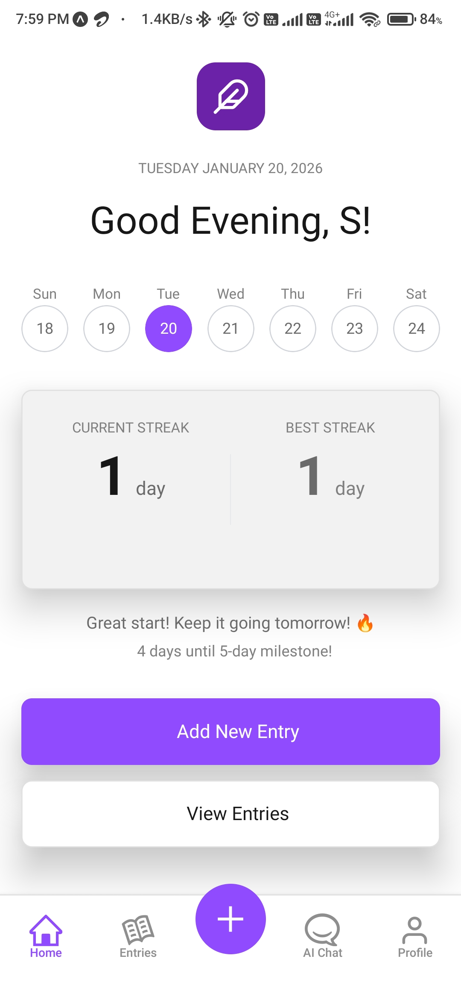
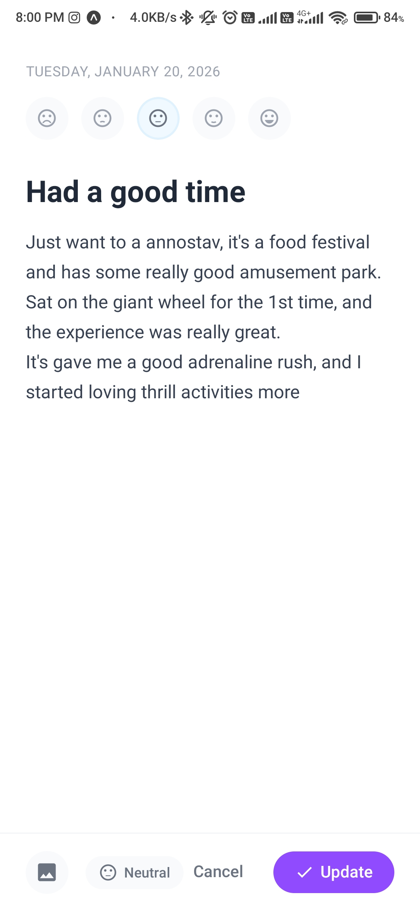
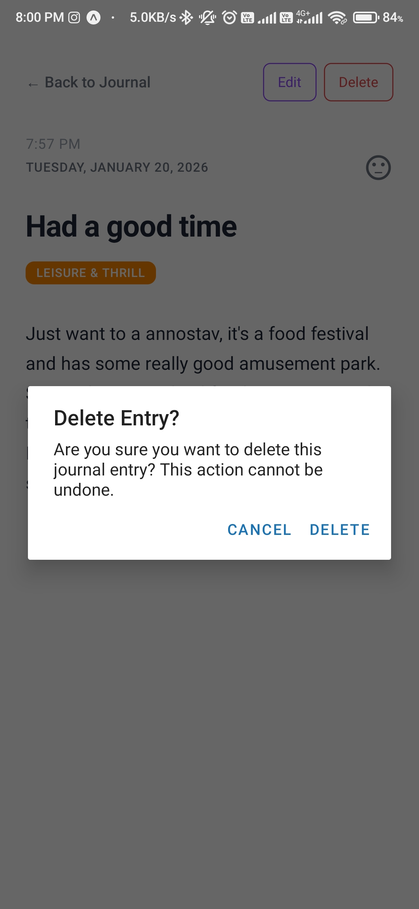
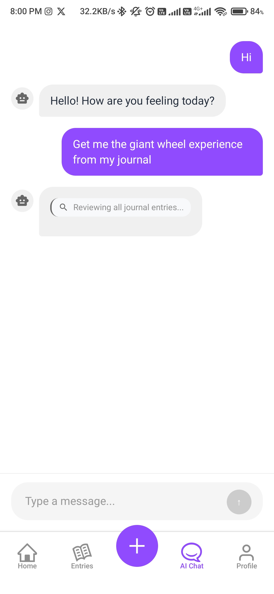
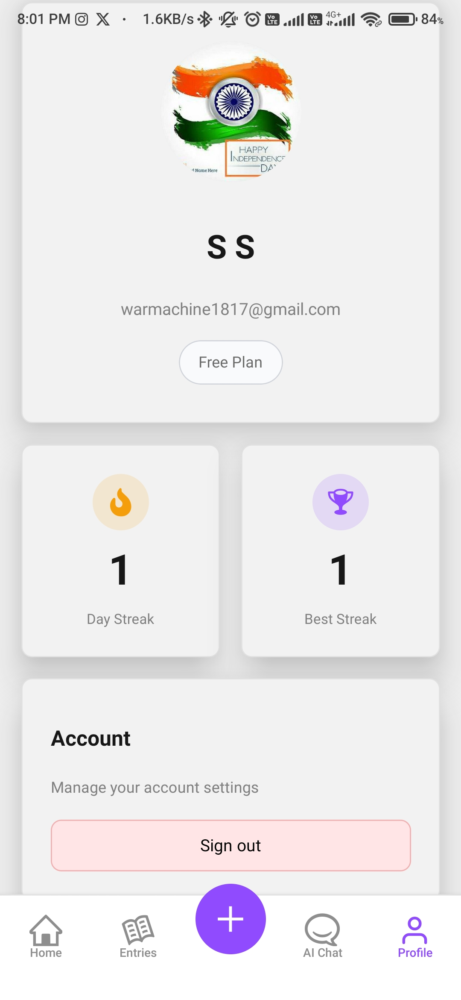

# Daylog

## App Showcase

Daylog is a comprehensive daily journaling application built with React Native and Expo. It helps users track their thoughts, moods, and daily experiences with AI assistance, daily prompts, and mood categorization.

### Key Features

- **Journal Entries**: Create, edit, and view detailed journal entries with timestamps and mood tracking.
- **AI Chat**: Engage with an AI-powered chat for journaling insights, reflections, and support.
- **Daily Prompts**: Receive inspirational prompts to spark creativity and consistent journaling.
- **Mood Tracking**: Categorize entries by mood and track streaks.
- **User Authentication**: Secure sign-in with Google for personalized experience.
- **Cross-Platform**: Runs on iOS and Android via Expo.

### Screenshots

Below are screenshots showcasing the app's user interface and functionality:

1. **Sign-In Screen**: Users authenticate with Google to access their journal.

   

2. **Home Dashboard**: Overview of recent entries, daily prompts, and quick actions.

   

3. **Creating a New Entry**: Interface for composing new journal entries with mood selection and categorization.

   

4. **Entries List**: Browse and filter all journal entries chronologically.

   

5. **AI Chat Interface**: Interactive chat with AI for journaling guidance and conversations.

   

6. **Profile and Settings**: Manage user profile, view streaks, and adjust app preferences.

   
