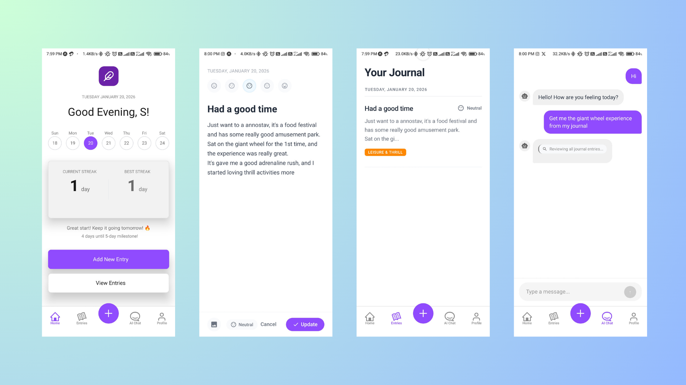
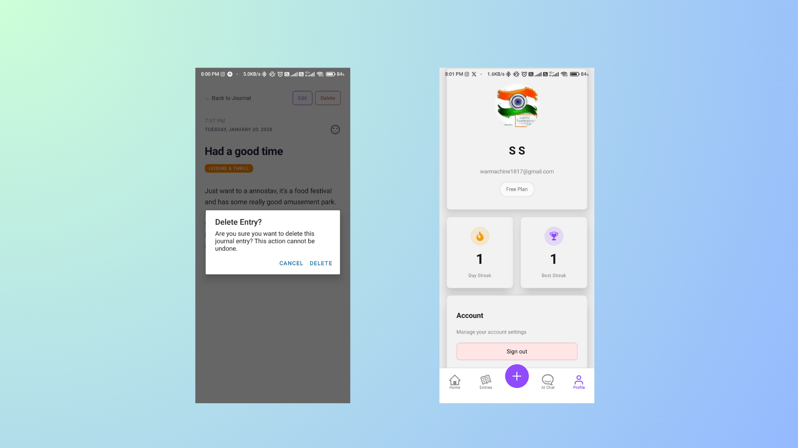

# Daylog

## App Showcase

Daylog is a comprehensive daily journaling application built with React Native and Expo. It helps users track their thoughts, moods, and daily experiences with AI assistance, daily prompts, and mood categorization.

### Key Features

- **Journal Entries**: Create, edit, and view detailed journal entries with timestamps and mood tracking.
- **AI Chat**: Engage with an AI-powered chat for journaling insights, reflections, and support.
- **AI Prompts**: Receive AI-generated journal prompts to spark creativity and consistent journaling.
- **Daily Prompts**: Receive inspirational prompts to spark creativity and consistent journaling.
- **Mood Tracking**: Categorize entries by mood and track streaks.
- **User Authentication**: Secure sign-in with Google for personalized experience.
- **Cross-Platform**: Runs on iOS and Android via Expo.

### Screenshots

Below are screenshots showcasing the app's user interface and functionality:

1. **App Interface Overview**`

   

   
